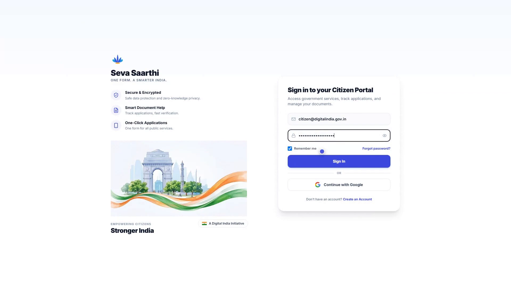
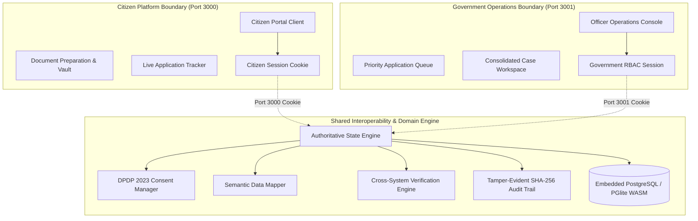

<div align="center">

# 🏛️ Seva Saarthi & Sarkaar Seva
### *Autonomous Sovereign Digital Public Infrastructure (DPI) & Dual-Platform Governance System*

[-black?style=for-the-badge&logo=next.js)](https://nextjs.org/)
[](https://www.typescriptlang.org/)
[](https://tailwindcss.com/)
[](https://supabase.com/)
[](https://electric-sql.com/docs/reference/pglite)
[](https://www.meity.gov.in/)
[](https://playwright.dev/)

<p align="center">
  A high-integrity public digital infrastructure platform unifying citizen service delivery with sovereign government operations.<br/>
  Engineered with <b>strict dual-platform origin isolation</b>, an <b>authoritative 12-stage state machine</b>, <b>verifiable DPDP Act 2023 consent records</b>,<br/>
  <b>semantic data mapping across state & central registries</b>, and <b>immutable cryptographic audit trails</b>.
</p>

[Demo Video](#-live-demo-walkthrough) •
[System Topology](#-system-topology) •
[Dual-Platform Architecture](#-dual-platform-architecture) •
[12-Stage State Machine](#-12-stage-orchestration-state-machine) •
[DPDP Act Compliance](#-dpdp-act-2023-consent-architecture) •
[Interoperability & Data Mapper](#-interoperability-hub--data-mapper) •
[Test Credentials](#-demo-accounts--test-credentials) •
[Quick Start](#-quick-start) •
[Verification Matrix](#-automated-verification-matrix)

</div>

---

## 🎬 Live Demo Walkthrough

https://github.com/SaiSankeerth-dev/SIH-26129/raw/main/SIH-Demo.mp4

<div align="center">

<video src="https://github.com/SaiSankeerth-dev/SIH-26129/raw/main/SIH-Demo.mp4" controls="controls" width="100%" poster="docs/images/sih-demo-thumbnail.png">
  <a href="https://github.com/SaiSankeerth-dev/SIH-26129/raw/main/SIH-Demo.mp4">
    
  </a>
</video>

<br/><br/>

[](https://github.com/SaiSankeerth-dev/SIH-26129/raw/main/SIH-Demo.mp4)
&nbsp;
[](https://github.com/SaiSankeerth-dev/SIH-26129/raw/main/SIH-Demo.mp4)

</div>

---

## 🎯 Executive Overview & Problem Statement

Modern public service delivery in India faces critical structural challenges:
1. **Portal Fragmentation**: Citizens must navigate dozens of disjointed central and state portals (PAN, Scholarships, Aadhaar, Caste/Income certificates, MeeSeva), each with conflicting schemas, file formats, and authentication mechanisms.
2. **Repetitive Manual Paperwork**: Citizens repeatedly upload and crop identical identity documents, leading to high rejection rates from non-compliant dimensions, low DPI, or unreadable scans.
3. **The "Black Box" Administrative Gap**: Once submitted, applications remain in ambiguous *"Processing"* states for weeks without stage-level accountability or actionable explanations.
4. **Administrative Overload & Disjointed Registries**: Government verification officers are forced to manually cross-reference citizen declarations across multiple external databases (UIDAI, CBDT, DigiLocker, state registries), leading to human bottlenecking and human error.

### The Solution
**Seva Saarthi & Sarkaar Seva** provides a unified, production-grade Digital Public Infrastructure that resolves this end-to-end:
- **Seva Saarthi (Citizen Platform — `:3000`)**: An intelligent citizen assistant with a unified digital profile vault, automated document preparation, multi-channel Supabase Auth with Google OAuth PKCE, and real-time state machine tracking.
- **Sarkaar Seva (Government Operations Platform — `:3001`)**: A prioritized administrative operations platform featuring an automated multi-registry cross-check engine, canonical data mapping, statutory AI case assistance, tamper-evident SHA-256 audit logging, and human-in-the-loop decision controls.

---

## 🏛️ System Topology



---

## 🔒 Dual-Platform Origin Isolation

To satisfy statutory cybersecurity standards and eliminate privilege escalation, the platform enforces strict network and execution boundary separation:

| Dimension | Citizen Platform (`Seva Saarthi`) | Government Platform (`Sarkaar Seva`) |
| :--- | :--- | :--- |
| **Origin Binding** | `http://localhost:3000` | `http://localhost:3001` |
| **Target User Base** | Indian Citizens & Applicants | Department Officers, Verifiers, System Admins |
| **Authentication** | Supabase Auth (SSR) + Google OAuth PKCE + Email | Salted PBKDF2 Officer Credentials + Multi-Factor RBAC |
| **Session Cookie** | `FORMLY_CITIZEN_SESSION` (Isolated) | `FORMLY_GOV_SESSION` (Isolated) |
| **Shell & Layout** | Clean Citizen Shell with Vault & Assistant | Administrative Operations Chrome & Queue Workspace |
| **Cross-Navigation** | Strict HTTP 403 Platform Origin Guard | Strict HTTP 403 Platform Origin Guard |
| **Data Scope** | Single Citizen Tenant Vault & Applications | Role-Assigned Department Queue & Verification Cases |

---

## ⚡ 12-Stage Orchestration State Machine

Every public service application (e.g. PAN Card, State Scholarship, Income Certificate) advances through a deterministic, event-driven state machine rather than opaque database flags:

```text
DRAFT
  ↓
SUBMITTED
  ↓
PRE_FLIGHT_VALIDATION  ──[ Missing / Invalid Info ]──► ACTION_REQUIRED (Citizen Correction)
  ↓
CONSENT_RECORDED
  ↓
REGISTRY_VERIFICATION  ──[ External API Offline ]──► API_UNAVAILABLE (Auto-Retry Queue)
  ↓
CROSS_SYSTEM_CHECK     ──[ Data Mismatch ]──────────► VERIFICATION_CONFLICT (Manual Review)
  ↓
GOVERNMENT_ROUTING
  ↓
OFFICER_ASSIGNED
  ↓
OFFICER_REVIEW         ──[ Return for Correction ]──► RETURNED_FOR_CORRECTION
  ↓
APPROVED
  ↓
DOCUMENT_GENERATION / PRINTING
  ↓
DISPATCHED
  ↓
DELIVERED / COMPLETED
```

---

## 🛡️ DPDP Act 2023 Consent Architecture

In compliance with India's **Digital Personal Data Protection (DPDP) Act 2023**, no data is transmitted between registries or presented to government officers without explicit, purpose-bound statutory consent:

- **Purpose Limitation**: Consent records explicitly cite the statutory provision and specify the exact purpose (e.g., *"Verification of identity for Form 49A PAN allocation under Section 139A of Income Tax Act"*).
- **Data Minimization**: Only the specific attributes mandated by the service are extracted and shared.
- **Granular Consent Metadata**: Each grant records citizen ID, timestamp, scope of fields, source registry, destination department, and an immutable consent signature.
- **Revocability**: Citizens retain statutory rights to view, audit, and revoke processing authorization from their digital vault.

---

## 🔄 Interoperability Hub & Data Mapper

Government databases across state and central jurisdictions use heterogeneous, incompatible field nomenclatures. The built-in **Semantic Data Mapper** normalizes external schemas into canonical citizen representations:

```text
UIDAI Registry              Formly Canonical Schema             CBDT / NSDL Registry
────────────────────────────────────────────────────────────────────────────────────
full_name             ───►  fullName                      ◄───  personName
date_of_birth (DD/MM) ───►  dateOfBirth (YYYY-MM-DD)      ◄───  dob (DD-MM-YYYY)
mobile_no             ───►  phoneNumber                   ◄───  phone
address_line          ───►  permanentAddress              ◄───  residentialAddress
```

### Cross-System Validation & Conflict Flagging
The engine automatically compares normalized attributes across registries:
- **Exact Match**: Automatically verified and marked for officer review.
- **Conflict Detected** (e.g., DOB in UIDAI is `1999-05-08` vs `2000-05-08` in 10th marks memo): The system flags `VERIFICATION_CONFLICT` and routes to manual review. **The AI never makes silent assumptions or overrides official records.**

---

## 📜 Cryptographic Tamper-Evident Audit Trail

Every operational decision, registry fetch, data correction, and officer approval is appended to an immutable audit log secured by **SHA-256 back-pointer hashing**:

$$\text{Hash}_n = \text{SHA-256}\left(\text{Hash}_{n-1} \,\|\, \text{Timestamp} \,\|\, \text{Actor} \,\|\, \text{Action} \,\|\, \text{Payload}\right)$$

Any retroactive database tampering immediately breaks hash verification across the audit chain.

---

## 🤖 Statutory AI Case Assistance (Human-in-the-Loop)

An integrated AI assistant (powered by Google Gemini) prepares clear, structured case dossiers for government officers:
- Synthesizes citizen declarations against uploaded documents and registry verifications.
- Highlights discrepancies, missing mandatory proofs, and risk markers.
- **Statutory Guardrails**: The AI operates strictly in an **advisory capacity**. It is mathematically and architecturally prohibited from approving applications, rejecting applications, or modifying citizen records without officer authorization.

---

## 👥 Demo Accounts & Test Credentials

### 1. Citizen Portal (`http://localhost:3000/login`)
- **Email:** `user@gmail.com`
- **Password:** `password123`
- **Alternative:** Continue with Google (Supabase OAuth PKCE)
- **Role:** Citizen / Applicant (Full profile, uploaded documents, active applications)

### 2. Government Operations Portal (`http://localhost:3001/gov/login`)
- **Employee ID / Email:** `officer@gmail.com`
- **Password:** `password123`
- **Department:** Department of Revenue / PAN Operations
- **Role:** Verification Officer / Desk Administrator

---

## 🚀 Quick Start

### 1. Prerequisites
- **Node.js**: v20.x or v22.x LTS
- **Package Manager**: npm v10+

### 2. Installation & Setup
```bash
# Clone the repository
git clone https://github.com/SaiSankeerth-dev/SIH-26129.git
cd SIH-26129

# Install dependencies
npm install

# Configure environment variables
cp .env.example .env.local
```

### 3. Running the Dual Platforms

Open two terminal sessions:

```bash
# Terminal 1: Launch Citizen Platform (Seva Saarthi) on Port 3000
npm run dev:citizen
# Accessible at: http://localhost:3000

# Terminal 2: Launch Government Operations Platform (Sarkaar Seva) on Port 3001
npm run dev:gov
# Accessible at: http://localhost:3001
```

---

## 🧪 Automated Verification Matrix

The repository includes a comprehensive, multi-layer automated verification suite:

```bash
# 1. Run Complete Government Pipeline & Orchestration Suite
npm test

# 2. Run Platform Boundary & Network Isolation Suite
npm run test:separation

# 3. Run Multi-User & Tenant Isolation Suite
npm run test:isolation

# 4. Run OAuth Redirect & Environment Resolver Suite
npm run test:oauth

# 5. Run Fresh Browser Context Integration Suite
npm run test:browser

# 6. Run Supabase SSR Auth & Live Dashboard Verification
node scripts/verify-supabase-auth-dashboard.mjs

# 7. Run Full TypeScript & Lint Verification
npm run lint

# 8. Run Production Turbopack Build
npm run build
```

---

## 📁 Repository Directory Structure

```text
SIH-26129/
├── src/
│   ├── app/
│   │   ├── (citizen)/               # Seva Saarthi: Citizen App Router pages (Port 3000)
│   │   │   ├── applications/        # Citizen application history & tracking
│   │   │   ├── dashboard/           # Citizen personal dashboard & readiness metrics
│   │   │   ├── documents/           # Digital document vault & PAN preparation
│   │   │   ├── login/               # Supabase Auth citizen sign-in view
│   │   │   ├── onboarding/          # Step-by-step canonical profile wizard
│   │   │   ├── profile/             # Citizen personal & academic identity
│   │   │   ├── services/            # Government scheme catalog & requirements
│   │   │   ├── settings/            # Citizen security & consent preferences
│   │   │   ├── signup/              # Citizen registration view
│   │   │   └── track/               # Live multi-stage state tracker
│   │   ├── gov/                     # Sarkaar Seva: Government Operations Platform (Port 3001)
│   │   │   ├── applications/        # Master application queue & filters
│   │   │   ├── audit/               # Cryptographic SHA-256 audit center
│   │   │   ├── dashboard/           # Operations metrics & daily SLA gauges
│   │   │   ├── data-mapper/         # Canonical registry schema mapping
│   │   │   ├── exceptions/          # Error management & API retry center
│   │   │   ├── interoperability/    # Registry connector health & monitoring
│   │   │   ├── login/               # Government employee RBAC sign-in
│   │   │   ├── monitoring/          # System throughput & performance stats
│   │   │   ├── queue/               # Officer priority desk & triage
│   │   │   └── workspace/[id]/      # Consolidated officer case review workspace
│   │   ├── api/                     # Next.js API Routes
│   │   │   ├── auth/                # Supabase session, login, logout, register
│   │   │   ├── citizen/             # Citizen document & application APIs
│   │   │   ├── gov/                 # Government queue, review, and workflow APIs
│   │   │   └── ai/                  # Server-side Gemini AI assistance endpoints
│   │   └── auth/callback/           # Supabase OAuth PKCE code exchange handler
│   ├── components/
│   │   ├── auth/                    # Unified CitizenAuthView (Google OAuth + Email)
│   │   ├── citizen/                 # Citizen layout, navigation, and headers
│   │   ├── dashboard/               # Citizen dashboard cards & readiness widgets
│   │   ├── documents/               # Smart document upload & OCR extraction
│   │   ├── gov/                     # Government operational consoles & workspaces
│   │   └── ui/                      # Shared accessible UI design system
│   ├── lib/
│   │   ├── auth/                    # OAuth redirect resolver & environment detection
│   │   ├── server/                  # Embedded PGlite PostgreSQL & migration engine
│   │   ├── store/                   # React state store & notification synchronizer
│   │   └── supabase/                # SSR client, server, and middleware helpers
│   └── middleware.ts                # Dual-platform origin isolation & security proxy
├── scripts/                         # Comprehensive automated test & validation suites
├── supabase/                        # Database migrations & seed schemas
└── public/                          # Optimized SVG icons, assets & national emblems
```

---

## ⚖️ License & Statutory Governance

Distributed under the **MIT License**. Engineered in accordance with the **Digital Personal Data Protection (DPDP) Act 2023** and **MeitY Open Standard Guidelines for Digital Governance Platforms**.
