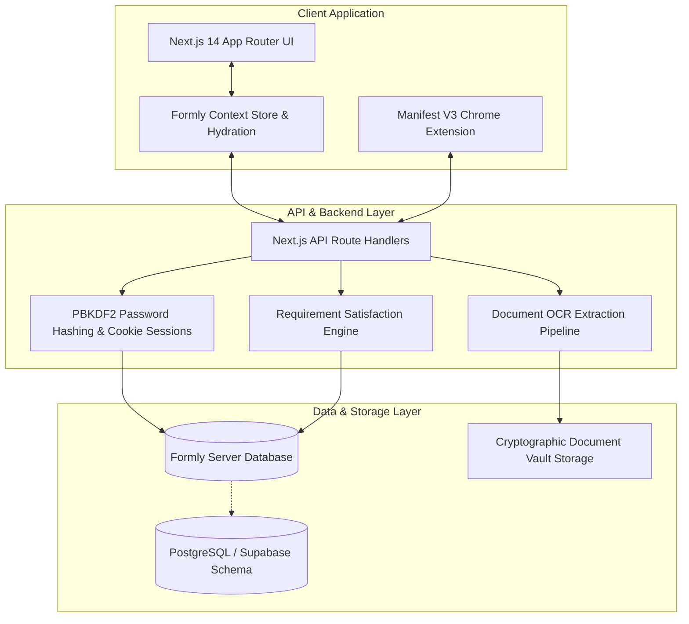
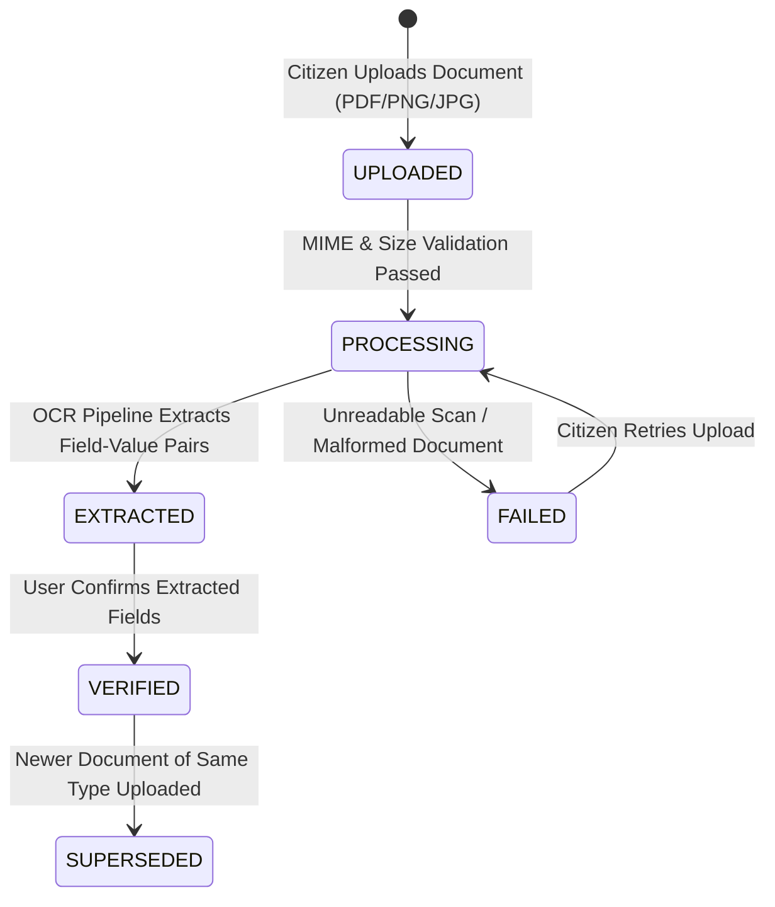

<div align="center">

# 🏛️ Formly
### *Next-Generation Citizen Preparation & Government Application Platform*

[](https://nextjs.org/)
[](https://www.typescriptlang.org/)
[](https://tailwindcss.com/)
[](https://developer.chrome.com/docs/extensions/mv3/intro/)
[](LICENSE)

<p align="center">
  <b>Formly</b> streamlines the citizen application journey for scholarships, government welfare schemes, and public services.<br/>
  Manage verified profiles, store documents in a cryptographic vault, extract data with high-confidence OCR,<br/>
  and track live 0–100% readiness checklists with a 1-click browser autofill companion.
</p>

[Key Features](#-key-features) •
[System Architecture](#-system-architecture) •
[Citizen Profile Schema](#-27-field-canonical-citizen-profile) •
[Document Vault & OCR](#-document-vault--ocr-pipeline) •
[Eligibility Checklist](#-requirement-matching-engine) •
[Chrome Extension](#-chrome-extension-1-click-autofill) •
[API Reference](#-api-reference) •
[Quick Start](#-quick-start)

</div>

---

## 🌟 Key Features

- **🔐 27-Field Canonical Citizen Profile**: Unified schema covering Identity, Education, Income/Reservation, and Banking/DBT Seeding with provenance tracking and field-level OCR confidence meters.
- **📁 Secure Document Vault**: Lifecycle management (`PROCESSING` → `EXTRACTED` → `VERIFIED` → `SUPERSEDED`) supporting Aadhaar, Income Certificates, Academic Transcripts, College IDs, and Bank Passbooks.
- **🤖 Human-in-the-Loop OCR Confirmation Gate**: Structured information extraction with confidence meters. Prevents unverified AI hallucinations by requiring explicit user confirmation before locking into verified profiles.
- **📊 Real-Time Readiness Checklist**: Automatically evaluates verified citizen data against official scheme criteria (e.g. *Post-Matric Scholarship Scheme for Higher Education*).
- **🛡️ Manual Requirement Resolution**: Allows citizens to provide custom justification notes to resolve edge-case requirements with audit-trail locking against auto-overwrites.
- **🔔 Live Pipeline Notifications**: Dynamic alerts reflecting real document OCR events, profile completeness, active scheme readiness milestones, and session security.
- **⚡ Manifest V3 Chrome Extension**: Secure 1-click autofill companion that connects to the authenticated citizen's live profile and injects data directly into government portals.
- **🧪 Built-in Portal Simulator**: Embedded scholarship application portal (`/portal/scholarships`) demonstrating real-time automated field mapping and visual verification.

---

## 🏛️ System Architecture



---

## 👤 27-Field Canonical Citizen Profile

All profile records adhere strictly to `CANONICAL_PROFILE_FIELDS` (`src/lib/constants/profile.ts`), grouped into four standardized categories:

| Category | Field Name | Description | Key Metric |
| :--- | :--- | :--- | :---: |
| **Identity & Personal** | `full_name` | Full legal name as per Aadhaar/10th | ⭐ Core |
| | `father_name` | Father's / Guardian's full name | |
| | `mother_name` | Mother's full name | |
| | `date_of_birth` | Date of birth (YYYY-MM-DD) | ⭐ Core |
| | `gender` | Gender (Male / Female / Other) | ⭐ Core |
| | `aadhaar_number` | 12-digit UIDAI Aadhaar number | ⭐ Core |
| | `phone_number` | Primary mobile number (Aadhaar linked) | |
| | `email` | Primary email address | |
| | `location` | Current City & State | ⭐ Core |
| | `permanent_address`| House No, Street, Landmark, Pincode | |
| **Academic Details** | `college_name` | College / University Name | ⭐ Core |
| | `education_degree`| Degree & Branch (e.g. B.Tech CSE) | ⭐ Core |
| | `current_year` | Current year / semester of study | |
| | `roll_number` | Roll / Hall Ticket / Registration Number | |
| | `tenth_percentage`| Class 10 (SSC) Percentage / GPA | |
| | `twelfth_percentage`| Class 12 / Intermediate Percentage | |
| **Income & Category** | `annual_income` | Annual Family Household Income in ₹ | ⭐ Core |
| | `income_cert_no` | MeeSeva / Revenue Certificate Application No | |
| | `caste_category` | General / OBC / SC / ST / EWS | |
| | `sub_caste` | Community / Sub-Caste Name | |
| | `minority_status` | Religious Minority Status | |
| | `disability_status`| Differently Abled / PwD Status | |
| **Banking & DBT** | `bank_name` | Bank Name & Branch | |
| | `bank_account_no` | Savings Bank Account Number | ⭐ Core |
| | `bank_ifsc` | Bank IFSC Code | ⭐ Core |
| | `account_holder_name`| Account Holder Name (Must match Aadhaar) | |
| | `dbt_seeding_status`| Aadhaar-NPCI DBT Seeding Status | |

> **Profile Strength Math**: Profile strength is calculated from the **10 Core Key Fields** (⭐).  
> **Remaining Details Math**: Computed as $27 - \text{Filled Fields}$, keeping `/profile`, `/notifications`, and the Header widget 100% in sync.

---

## 📄 Document Vault & OCR Pipeline



### Strict Provenance & Zero Silent Writes
1. OCR parses file contents and stages candidate fields with confidence scores (0.00 – 1.00).
2. The citizen is presented with the **Field Confirmation Gate** to review or modify values before saving.
3. Once accepted, fields are locked into `profile_fields` with `verified = true`, `confirmed_at = now()`, and `source_document_id = doc.id`.

---

## 🎯 Requirement Matching Engine

The satisfaction engine evaluates scheme criteria dynamically:
1. **Personal Information Rules**: Automatically satisfied when verified matching profile fields exist.
2. **Document Rules**: Automatically satisfied when an un-superseded verified document of matching type exists in the vault.
3. **Manual Resolution & Lock (F10)**: Citizens can mark an edge-case requirement as `MANUALLY_RESOLVED` with a justification note. Manual resolutions are locked against automated overwrites.
4. **Clean Invalidation**: If a supporting document is deleted or superseded, unlocked requirements revert to `MISSING`.

---

## 🧩 Chrome Extension (1-Click Autofill)

Formly includes a Manifest V3 browser extension located in [`extension/`](extension/):
- **Real Data Integration**: Queries the authenticated citizen's profile from `/api/profile` on `localhost:3000`.
- **Intelligent DOM Matching**: Detects form inputs using heuristics (ID, name, label, placeholder, aria attributes) for personal, academic, income, and banking details.
- **Reactive Framework Support**: Triggers synthetic `input`, `change`, and `blur` events so React, Angular, and Vue portals persist filled values.
- **Non-Intrusive Floating Button**: Anchored to `bottom: 24px; right: 24px` with iframe and CAPTCHA isolation to avoid interfering with reCAPTCHA or third-party widgets.

### Loading the Extension:
1. Open Chrome and navigate to `chrome://extensions`.
2. Enable **Developer mode** (toggle in top-right corner).
3. Click **Load unpacked** and select the `extension/` folder from this repository.
4. Visit any application form or [`http://localhost:3000/portal/scholarships`](http://localhost:3000/portal/scholarships) to test 1-click autofill.

---

## 🔌 API Reference

| Method | Endpoint | Description |
| :--- | :--- | :--- |
| `POST` | `/api/auth/register` | Register new citizen account with PBKDF2 salt hashing |
| `POST` | `/api/auth/login` | Authenticate session and set secure HTTP cookie |
| `GET` | `/api/auth/session` | Validate active session token |
| `POST` | `/api/auth/logout` | Terminate session and invalidate cookie |
| `GET` | `/api/profile` | Retrieve verified profile fields with document provenance |
| `PATCH`| `/api/profile` | Update single field `{ field_name, value }` or batch `{ fields }` |
| `GET` | `/api/documents` | List all vault documents with extraction metadata |
| `POST` | `/api/documents` | Upload document to vault and trigger OCR pipeline |
| `DELETE`| `/api/documents/:id` | Delete document and cascade unverify associated fields |
| `POST` | `/api/documents/:id/extracted-fields/:fieldId/accept` | Accept candidate field into profile |
| `POST` | `/api/documents/:id/extracted-fields/:fieldId/reject` | Discard candidate field |
| `GET` | `/api/services/:id/checklist` | Compute requirement readiness checklist for a scheme |
| `POST` | `/api/requirements/:id/resolve` | Manually resolve requirement with audit note |
| `POST` | `/api/requirements/:id/unresolve` | Revert manual resolution to automatic matching |

---

## 🚀 Quick Start

### Prerequisites
- **Node.js**: v18.0.0 or higher
- **npm**: v9.0.0 or higher

### Installation & Run
```bash
# 1. Clone the repository
git clone https://github.com/SaiSankeerth-dev/Formly.git
cd Formly

# 2. Install dependencies
npm install

# 3. Setup environment variables (optional for local DB)
cp .env.example .env.local

# 4. Start development server
npm run dev
```
Open **[http://localhost:3000](http://localhost:3000)** in your browser.

---

## 🛠️ Verification & Build Commands

```bash
# TypeScript type check (0 errors)
npm run typecheck

# ESLint validation (0 errors)
npm run lint

# Production build
npm run build
```

---

## 📄 License

This project is licensed under the **MIT License** — see the [LICENSE](LICENSE) file for details.
