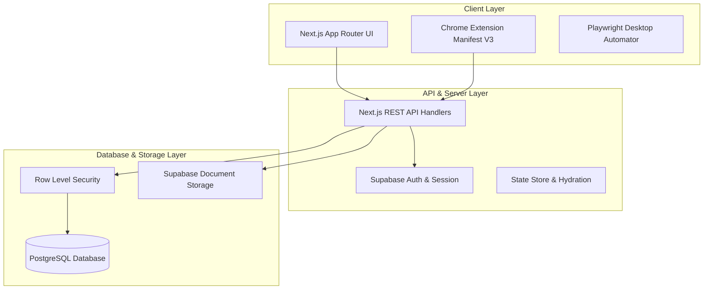
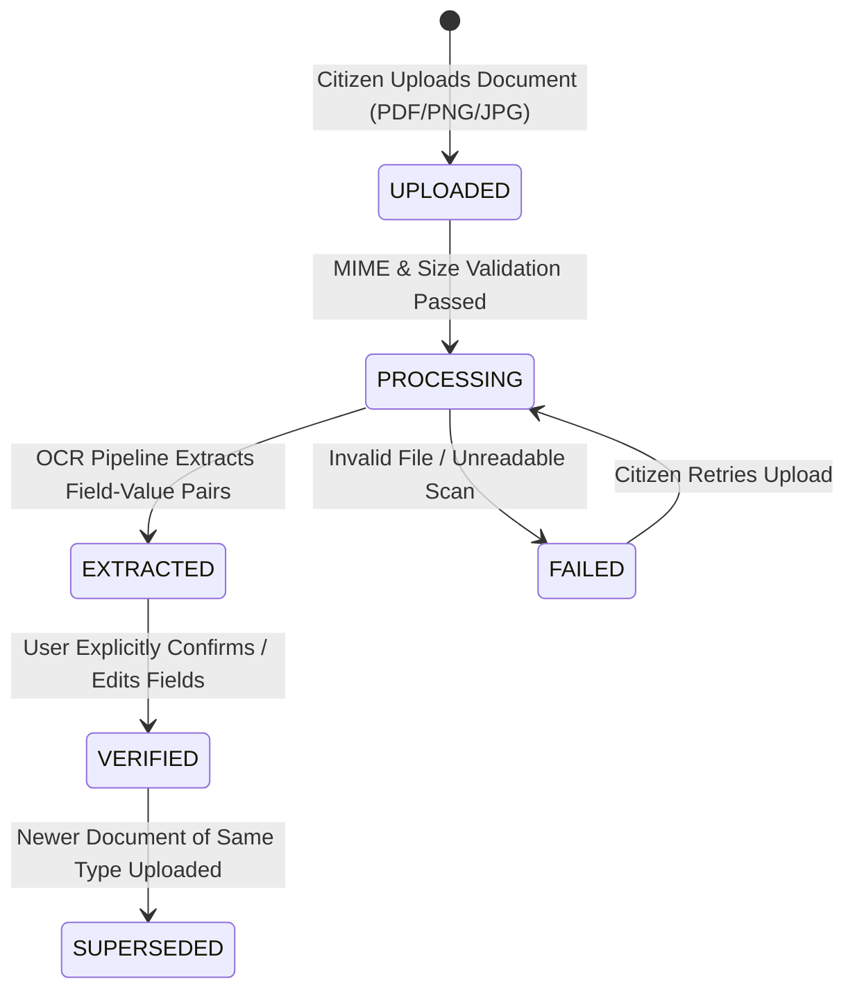

<div align="center">

# 🏛️ Formly (Seva Saarthi)
### *Next-Generation Citizen Preparation & Government Application Platform*

[](https://nextjs.org/)
[](https://www.typescriptlang.org/)
[](https://tailwindcss.com/)
[](https://supabase.com/)
[](https://playwright.dev/)
[](LICENSE)

<p align="center">
  Formly bridges the gap between citizens and complex public sector schemes.<br/>
  Prepare verified profiles, store documents in a cryptographic vault, extract data with high-confidence OCR,<br/>
  and track live 0–100% readiness checklists before applying on official government portals.
</p>

[Key Features](#-key-features) •
[Architecture](#-system-architecture) •
[Document Pipeline](#-document-vault--ocr-pipeline) •
[Readiness Engine](#-requirement-matching-engine) •
[API Reference](#-api-reference) •
[Quick Start](#-quick-start) •
[Browser Extension](#-chrome-extension)

</div>

---

## 🌟 Key Features

- **🔐 Reusable Citizen Profile**: Personal, Address, Education, Income, and DBT Bank details with field-level confidence scoring and document provenance tracking.
- **📁 Secure Document Vault**: Lifecycle management (`PROCESSING` → `EXTRACTED` → `VERIFIED` → `SUPERSEDED`) with support for Aadhaar, Income Certificates, Academic Transcripts, and Bank Passbooks.
- **🤖 OCR & Field Confirmation Gate**: Structured information extraction with confidence meters. Prevents unverified AI hallucination by requiring explicit user confirmation before writing to verified profiles.
- **📊 Real-Time Readiness Checklist**: Automatically maps verified citizen data against official scheme requirements (e.g. *Post-Matric Scholarship Scheme for Higher Education*).
- **🛡️ Manual Requirement Resolution**: Allows citizens to provide custom justification notes to resolve edge-case requirements with persistent lock protection against auto-overwrites.
- **⚡ Assistive Autofill Companion**: Includes an in-app portal simulator, a desktop Playwright Chrome runner, and a Manifest V3 Chrome Extension for official government portals.

---

## 🏛️ System Architecture



---

## 📄 Document Vault & OCR Pipeline



### Strict Provenance & Zero Silent Writes
When OCR extracts fields from an uploaded document:
1. Fields are staged in `extracted_fields` with a confidence score (0.00 – 1.00).
2. The citizen is presented with the **Field Confirmation Modal** to review, modify, or reject each field.
3. Only upon citizen acceptance is the field written to `profile_fields` with `verified = true`, `confirmed_at = now()`, and `source_document_id = document.id`.

---

## 🎯 Requirement Matching Engine

The core database function `recompute_requirement_status(user_id, service_id)` operates atomically and guarantees:
1. **Idempotency**: Generates missing requirement rows dynamically.
2. **Dynamic Evaluation**: Evaluates both `PERSONAL_INFORMATION` (verified profile fields) and document types (`IDENTITY_DOCUMENT`, `INCOME_DOCUMENT`, `EDUCATION_DOCUMENT`, `BANK_DOCUMENT`).
3. **Lock Protection**: Any requirement marked `MANUALLY_RESOLVED` has `locked = true` and is **never** silently overwritten by automated recomputation.
4. **Clean Invalidation**: If supporting documents are removed or unverified, unlocked requirements revert from `SATISFIED` to `MISSING`.

---

## 🗄️ Database Schema & RLS

```
+-----------------------------------------------------------------------------------+
|                                  DATABASE TABLES                                  |
+-----------------------------------------------------------------------------------+
| • profile_fields      | User profile attributes, verification status, provenance  |
| • documents           | Uploaded files, document types, status, OCR raw text      |
| • extracted_fields    | Staging area for OCR outputs prior to user confirmation   |
| • services            | Catalog of government programs and official portal URLs   |
| • service_requirements| Mandatory criteria, guidance text, and expected doc types |
| • requirement_status  | Source of truth for citizen readiness (SATISFIED/MISSING)|
+-----------------------------------------------------------------------------------+
```

All tables enforce **PostgreSQL Row-Level Security (RLS)** ensuring complete tenant isolation (`auth.uid() = user_id`).

---

## 🔌 API Reference

| Method | Endpoint | Description |
| :--- | :--- | :--- |
| `GET` | `/api/profile` | Retrieve the authenticated citizen's profile fields and provenance |
| `PATCH` | `/api/profile` | Update profile fields manually with conflict resolution |
| `GET` | `/api/documents` | List all vault documents with status and metadata |
| `POST` | `/api/documents` | Upload a new document and initiate OCR pipeline |
| `GET` | `/api/documents/:id` | Fetch specific document details and extracted staging fields |
| `POST` | `/api/documents/:id/extracted-fields/:fieldId/accept` | Accept an extracted field into verified profile |
| `POST` | `/api/documents/:id/extracted-fields/:fieldId/reject` | Reject an extracted field |
| `GET` | `/api/services/:id/checklist` | Get requirement status and readiness score for a service |
| `POST` | `/api/requirements/:id/resolve` | Mark a requirement as manually resolved with user note |
| `POST` | `/api/requirements/:id/unresolve` | Revert a manual resolution to automatic matching |

---

## 🚀 Quick Start

### Prerequisites
- **Node.js**: v18.0.0 or higher
- **npm**: v9.0.0 or higher

### Installation
```bash
# 1. Clone the repository
git clone https://github.com/SaiSankeerth-dev/Formly.git
cd Formly

# 2. Install dependencies
npm install

# 3. Setup environment variables
cp .env.example .env.local

# 4. Start the development server
npm run dev
```
Open **[http://localhost:3000](http://localhost:3000)** in your browser.

---

## 🧩 Chrome Extension & Automation

Formly includes a Manifest V3 Chrome Extension located in [`extension/`](extension/) for assisting on live external portals (e.g. `scholarships.gov.in`, `onlineservices.proteantech.in`):

1. Open Chrome and navigate to `chrome://extensions`.
2. Enable **Developer mode** (top right).
3. Click **Load unpacked** and select the `extension` folder.
4. Browse to any supported government portal and click **"Autofill with Formly"** or press `Alt + Shift + F`.

---

## 🛠️ Scripts & Tooling

```bash
# Start local development server
npm run dev

# Run TypeScript compiler check
npx tsc --noEmit

# Run ESLint validation
npm run lint

# Build optimized production bundle
npm run build

# Run headed Playwright desktop automator
npm run agent
```

---

## 📄 License

This project is licensed under the **MIT License** — see the [LICENSE](LICENSE) file for details.
